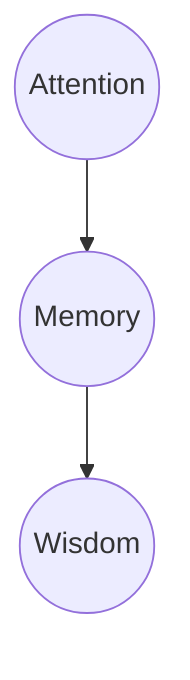

The following is an amalgamation from many different sources. I have cited the sources as best as possible. 

# THIS POST IS STILL UNDER CONSTRUCTION so some links and text might look wonky

# Table of Contents
1. [Example](#example)
2. [Example2](#example2)
3. [Third Example](#third-example)
4. [Fourth Example](#fourth-examplehttpwwwfourthexamplecom)

3. Revising? -> blurting method/writing FBR
4. Procrastinating? -> 5 minute rule
5. Memorizing? -> spaced repetition with Anki
6. Multiple subjects? -> interleaving

# THE VALUE OF 5–10-MINUTE BREAKS
The serial position effect refers to improved recall observed at the beginnings and ends of lists. Separately, these are called the primacy effect and recency effect, respectively. Memorizing a hypothetical list of 20 words, your recall might look something like this:
  
  This mid-list dip can be observed in study sessions as well, so a 90-minute session might resemble the below graph:
  
  We can dramatically improve recall by splitting that single session into two sessions of 45 minutes with a 10-minute break in between.
   ([View Highlight](https://read.readwise.io/read/01gsxe7fwhf2wa88v0b6bjr6h1))
    - Note: [[The Science of Successful Learning]] this explains why the pomodoro method works
- THE VON RESTORFF EFFECT
  
  The Von Restorff effect, also called the novel popout effect,[‡](https://readwise.io/reader/document_raw_content/25261931#e_10) correlates unique items in a list to better recall. For example, if the fifth item in a word list uses a unique color or a larger font size, it will be better remembered than others. This is perhaps obvious. What isn’t obvious is that planting odd material in the middle of a session can produce a macro–Von Restorff effect.
  Let’s assume we have a list of 100 plain-Jane, high-frequency words, split into 50 words per 45-minute session. The recall will look just as it did in the primacy and recency effect graph.
  Now we spike the punch in the middle of each 45-minute session, injecting 2–4 idiomatic phrases that are sexually related from minutes 20–25. There are two content changes: the sexual content and, almost as important, the word-to-phrase shift. In my experience, the memory curves can then morph into the above graph.
  Instead of averaging out at 60%–70% recall over a week, say, we can get well over 80%. Furthermore, it’s a more sustainable and pleasant learning approach. This is the approach I used with the Linkword method to achieve more than 85% retention of 350 Italian words 72 hours after cramming them into 12 hours.

---

> No matter who you are, we all have 24 hours in a day—168 hours in a week. What will you accomplish in that time? At the end of each day, we are the product of our choices.
> 

<aside>
⚙️ Productivity is spending time well. Are you being productive or are you being busy?
</aside>

# Introduction

---

Content extracted from:

[How we learn: the secret to all learning](https://www.brainscape.com/academy/how-we-learn/)

Nowadays, it seems like everyone with an Internet connection has some kind of **miracle shortcut** or **fast-track step-by-step** plan to help you learn anything and learn better, whether it’s a language, cooking *boeuf bourguignon*, developing rippling abs, or becoming a lawyer.

Meditation retreats, speed reading, pills and supplements, superfoods, gamification of learning, mnemonic devices … you name it, someone has an opinion on it being the “miracle solution” to learning better than ever before.

Sorry to be a total party pooper but these things are all just **short-term hacks** or **marginal productivity boosters**. There really is only one guaranteed long-term growth tactic for human development and it’s spaced repetition. In this guide, we’re going to explain exactly why it’s the secret to how we learn and how it can be harnessed to improve your:

- Studies,
- Mental health, and
- Biological capabilities

You see, spaced repetition is **the way your brain is hardwired to learn.** The more it sees information—or rehearses skills or thought patterns—the easier it’ll remember that information/skill/thought pattern. It’s biology, baby.

It’s [well-established science that spaced repetition](https://www.brainscape.com/spaced-repetition) is the best, most efficient method for human development. (It's why Brainscape’s adaptive learning platform helps ***millions of people*** master knowledge, facts, and languages multiple times faster than traditional methods.)

But it’s also the mechanism behind **literally every biological development** that involves cell memory! Particularly *brain* cell memory, when combined with motivation and deliberate cognitive processing.

So if you want the ultimate toolkit for human development—whether skills-based, knowledge-based or even a mindset—stick around. We’re going to explain the science of learning right now!

---

# Why Learn?

---

- We learn because it is critical for preserving ourselves in our navigation of the world.

> Learning is a relatively permanent change in knowledge/behavior resulting from past experience.
> 
- Without learning, we wouldn't be able to properly adjust ourselves to what is required out of us. In short, without learning, ***we wouldn't live.***
- A part of learning is thinking and attention.

> Thinking is a cognitive behavior in which ideas, images, mental representations, or other hypothetical elements of thought are experienced or manipulated. In this sense, thinking includes imagining, remembering, problem solving, daydreaming, free association, concept formation, and many other processes. Thinking encompasses a flow of ideas and associations that can lead to logical conclusions.
> 
- Attention is the mother of memory and memory is the mother of all wisdom.

# Why Study?

---

- We study so that we can commit our learning to memory. In other words, we study to remember what we learn.
- The more learning that we commit to memory, the greater our performance over time. In other words, we are better able to properly adjust ourselves to what is required out of us.
- In short, more studying commits more of our learning to memory, and ***we can live better.***

    
Memory is not about collection, it’s about connection. Don’t let your prior beliefs pigeonhole your learning, otherwise, you will not learn new things.

## Beliefs that often obstruct learning new things

- "Learning is fast."
- "Knowledge is composed of isolated facts."
- "Being good at a subject is a matter of inborn talent."
- "I'm really good at multi-tasking."

<aside>
⚠️ All in all, committing our learning to memory is great. Although, beware that forgetting is a threat to our memory.
</aside>

# Who is Our Enemy for Learning?

Faculty are not our enemy. When we learn new things, we are committing those new things to memory, and we can lose that memory through forgetting.

> We want to combat our enemy: the forgetting curve.

## The Forgetting Curve

Formulated by Ebbinghaus. The theoretical curve explains how acquired knowledge fades from memory over time.

- Let’s say you just tried a new card game today, playing a couple of rounds with friends before packing it in and doing something else. You'll probably need to play that game again very soon *if you want to remember it*. Otherwise, the next time you play, you'll basically have to re-learn it from scratch.
- The same applies to learning a more complex, long-term skill like guitar. If you want to learn a new chord transition or riff today, you'll probably need to repeat it like 100 times before you get it down perfectly. Then, you should ideally practice it again 30 times in an hour from now. Then 10 times tomorrow, 5 times next week, and finally at least once a month before the new guitar technique has become fully "internalized".
- These numbers are, of course, theoretical. The point is that you can't *learn anything new* unless you are **systematically refreshing** the foundations of everything you have learned *before*, through the right pattern of repetition.
- Your brain cells and their connections need continual strengthening. Otherwise, they *decay*, and you can't build upon them. You will learn that there are effective and ineffective ways to prepare.

## The Seven Sins of Memory (Daniel Schacter)

<aside>
❗ Numbers 1-3 are sins of omission; 4-7 are sins of commission.

</aside>

1. Transience: forgetting over time
2. Absent-mindedness: breakdown of the interface of memory and attention
3. Blocking: memory is available, but recall is difficult
4. Misattribution: recall some aspect of an event correctly, but get source wrong
5. Suggestibility: misinformation is incorporated into memory
6. Bias: our current knowledge, beliefs, and feelings impact/skew/distort memories
7. Persistence: intrusive memories, often traumatic

---

# Combatting Our Enemy, the Forgetting Curve, by Using Effective Ways to Learn and Remember (SAAD)

<aside>
📢 The following four ways are effective study strategies for learning because they commit learning to memory by achieving deep processing which makes memory less liable to be forgotten.

</aside>

1. Spaced repetition
2. Active recall
3. Associations
4. Desirable difficulty

---

# Spaced Repetition/Retrieval

---

<aside>
🥇 The number one way to halt the forgetting curve is through spaced repetition/retrieval. You can do this through spacing out bouts of self-testing which practices retrieving new learning from memory with the appropriate retrieval and application.

</aside>

> "The Testing Effect (the power of retrieval): A child stringing cranberries on a thread goes to hang them on the tree, only to find they’ve slipped off the other end. Without the knot, there’s no making a string. Without the knot there’s no necklace, there’s no beaded purse, no magnificent tapestry. Retrieval ties the knot for memory. Repeated retrieval snugs it up and adds a loop to make it fast" (Make it Stick).
> 
- Space out your retrieval practice until you can:
    1. Practice without referring to notes
    2. Practice using the information in a way the teacher expects
- Spaced repetition disrupts the forgetting curve. The less the decay, the flatter the curve – that is, the longer the memory lasts.

- *Spacing out your retrieval practice is the **whole** premise of spaced repetition*. The science of learning shows that the right interval between repetitions is *the longest interval before which you would have otherwise forgotten the concept*.
- So, if you can figure out how to practice a skill or repeat knowledge you need to learn in the short, medium, and long term, then you’ll have a solid plan for learning it so much more efficiently.
- The "forgetting curve" I mentioned earlier can also apply to abstract mental health skills like reducing anxiety, improving sleep, practicing gratitude, and even forgiving people who have wronged you. How many times have you vowed to adopt a better, more positive mental attitude?
- Every New Year’s Eve, right?
- Well, the reason you think and respond the way you do to certain emotional or physical stimuli is that your brain is **caught up in a pattern of thinking**. And you don’t change patterns by simply telling your champagne-soaked brain at midnight that “this year, I’m going to practice gratitude every day!”
- It takes **practice and repetition** to ingrain new habits, even if—*especially if*—those habits are ways of thinking that aren’t working for you anymore. Spaced repetition helps shift out that forgetting curve in just the same way it does with studying or learning!

*The more often you practice a skill or are exposed to information, the longer you’ll remember it, shifting out that "forgetting curve" until you hit a critical mass and that information / skill becomes a permanent part of your memory bank.*

Let’s look at an example: imagine you have just been exposed to a new skill like quieting your stress and become at peace with yourself through the power of practicing gratitude. Your initial exposure to this new skill is depicted in the above graph in line ***i***.

If you only practice that gratitude *once*, the effects will eventually decrease to zero within a few days, and you will have "forgotten" all that inner peace you had gained from your initial gratitude session.

But if you repeat your gratitude practice over time, then each repetition will push out the "forgetting curve" further (all the way out to curve ***iv*** in the above graph), in the same way, that well-spaced flashcard repetitions make your Spanish verb conjugation skills more permanent.

[How to study effectively: The ultimate guide](https://www.brainscape.com/academy/how-to-study-effectively/)

Eventually, your brain will “permanently remember” your new happy, peaceful mindset, and you will be able to devote your daily mindfulness practices to other mantras besides just gratitude, thus building upon those stronger foundations you'd established.

This is the same reason why a meditation retreat isn't going to permanently solve all of your mental health challenges. Sure, going on a two-week Vipassana outing in the mountains with minimal food, no speaking, and no iPhone can be an *incredibly powerful meditative experience* that brings you mental peace for several weeks.

Yet, unless you **continue to apply** those daily mindfulness tools during the weeks, months, and years after that retreat, you're eventually going to slip back into your old destructive mental patterns and habits.

Now, let’s look at how spaced repetition can help you become a master of your own biology!

## **The secret to human (biological) development**

In the same way you can't build permanent brain cell connections by cramming the night before a test—or cramming all your life's meditation into a one-week retreat—you also can't achieve other permanent biological enhancements by cramming.

Building muscle strength or flexibility is a major example of this. Exercising over and above what you’re accustomed to actually tears muscle fibers (that’s why they hurt the day after). Your muscles will then "remember" the stress you've put them through and grow back *bigger and stronger*. But **only if you continually exercise over time**.

You can't just do bench presses for 24 hours straight one day so that you can stay jacked for the rest of the year. You have to *be consistent* in order to keep growing; although you can spread your workouts over a longer period of time if all you want to do is "maintain" your muscle.

[Optimize your brain health for effective studying](https://www.brainscape.com/academy/brain-health-studying/)

This is the same reason that trees growing in windy areas become stronger by developing "stress wood" — but only if the wind is **prolonged** over time. One big hurricane won't be enough to make a sapling strong forever (if it doesn't kill it, to begin with). Trees need the spaced repetition of windy days in order to "learn" to build stronger fibers.

*Trees growing in areas of consistent winds respond by developing stronger fibers, greater flexibility, and even by bending away from the wind (so as to reduce resistance) as you see in the above picture.*

Spaced repetition even applies to your immune system. You might get a full dose of a certain vaccine today, then a booster dose in 6 months, and another booster in 10 years. Your immune system ***remembers*** the resistance it developed in response to the vaccine “instruction.” And doctors have figured out the optimal period of time for the booster, which is *just before* your body might have otherwise forgotten how to protect itself against a pathogenic threat.

This is why I mentioned earlier that spaced repetition is the secret to all "cell memory", not just learning and brain cells!

## **Spaced repetition: the next chapter in human development**

Consistency, with systematically expanding intervals of repetition, is the **secret to all biological growth**, human and otherwise. There are no shortcuts. No cramming. The world is beginning to realize this and so should you, if learning is important to you.

Reaching the apex of your abilities involves atomizing your cognitive, mental, and biological growth into its fundamental building blocks, and then systematically repeating exercises that challenge the strength of those building blocks to their limits.

---

# Active Recall

---

<aside>
🗃️ Do not engage with your learning and memory passively. Simple exposure does not sufficiently commit things to memory.

</aside>

- For example simply highlighting notes is a passive way of studying that does not yield long term commitment to memory.
- Also, recognition is also a similar yet separate form of studying which isn’t as effective as active recall.
- "How readily you can recall knowledge from your internal archives is determined by context, by recent use, and by the number and vividness of cues that you have linked to the knowledge and can call on to help bring it forth" (Make it Stick).

## Distinctiveness

- Unusual information has the effect to generally be **recalled better than common information.**

## Mnemonic Devices

- Any learning technique that aids information retention or retrieval (remembering) in the human memory for better understanding.
    - SAAD is one such mnemonic device that aims to help you remember the four effective strategies for learning: Spaced repetition, Active recall, Associations, Desirable difficulty.
- Chunking large bits of information into more digestible bits.
    
    [Expert Chess Memory: Revisiting the Chunking Hypothesis](https://doi.org/10.1080/741942359)
    

## Flashcards

- You have to master the basics before moving on to more complex skills.
- Use Anki. It is an open-source flashcard application that uses spaced repetition algorithms to **help you prevent natural forgetting**. Anki can help you to intentionally commit information into long-term memory by automatically adjusting based upon your unique pace of learning.

[Anki - powerful, intelligent flashcards](https://apps.ankiweb.net/)

---

# Associations

---

<aside>
✅  Make correct use of the information that you are learning and committing to memory.

</aside>

## Reflection/Personal

- A process of personalizing and understanding the contents, process, and the rationales for what we have learned. Through reflection, we relate our personal experience to a wider perspective, which helps us to see the bigger picture. Recognize and take advantage of prime learning opportunities so that you have a larger pool of reflective/personal experiences to draw from.

## Elaboration

- A cognitive learning strategy that involves any enhancement of information that clarifies or specifies the relationship between information to-be-learned and related information, i.e., a learner's prior knowledge and experience or contiguously presented information. Find the value in what you are studying in order to do your best.

## Sanctity of Space

- Consider the contextual associations for the places where you intend to work.
    - For example, try not to work on your bed because you associate your bed with sleeping—not studying.

## Sherlock's Mind Palace (Method of Loci)

- Using images to cue memories of what you learned.

## Generation of Questions or Concept maps

- This process transforms what you are learning by making it meaningful and engaging.

## Depth of Processing MATTERS!

[How to Get the Most Out of Studying: Part 2 of 5, "What Students Should Know About How People Learn"](https://www.youtube.com/embed/9O7y7XEC66M?autoplay=1&rel=0)

---

# Desirable Difficulty

---

<aside>
💪 Make studying an optimal challenge with just enough frustration. Your level of understanding is a direct result of how hard you prepare. Improvement involves dealing with challenges, difficulty, and uncertainty.

</aside>

- "Embrace the fact that significant learning is often, or even usually, somewhat difficult. You will experience setbacks. These are signs of effort, not of failure. Setbacks come with striving, and striving builds expertise. Effortful learning changes your brain, making new connections, building mental models, increasing your capability. The implication of this is powerful: Your intellectual abilities lie to a large degree within your own control. Knowing that this is so makes the difficulties worth tackling. Following are three keystone study strategies. Make a habit of them and structure your time so as to pursue them with regularity" (Make it Stick).

## Interleaving Topics

- "First, that some difficulties that require more effort and slow down apparent gains—like spacing, interleaving, and mixing up practice—will feel less productive at the time but will more than compensate for that by making the learning stronger, precise, and enduring. Second, that our judgments of what learning strategies work best for us are often mistaken, colored by illusions of mastery" (Make it Stick).
    - We can accomplish this by interleaving the study of different problem types.

## Illusion of Mastery

- Brute rote and repetitive memorization feeds the illusion of mastery. As a result we develop poor metacognition where we think we know what we know. The Dunning-Kruger Effect warns us not to confuse confidence for competence. It ain't what you don't know that gets you into trouble, it's what you think you know that ain't so. Sadly, many of our poor study strategies rest on faith and intuition. Overconfidence should be avoided at all costs.
    - "We harbor deep convictions that we learn better through single-minded focus and dogged repetition, and these beliefs are validated time and again by the visible improvement that comes during “practice-practice-practice.” But scientists call this heightened performance during the acquisition phase of a skill “**momentary strength**” and distinguish it from “**underlying habit strength**.” The very techniques that build habit strength, like spacing, interleaving, and variation, slow visible acquisition and fail to deliver the improvement during practice that helps to motivate and reinforce our efforts" (Make it Stick)
        - Internalization of behaviors vs externalization of behaviors

### Automaticity

- Where a process is so highly practiced that it occurs without any conscious effort.
    - For example, blocking in classical conditioning.

### Overlearning

- Continuing to study beyond just knowing information to where it can be recalled quickly and easily.

### Blurting

- As a way to find out if we are falling victim to the illusion of mastery, we can try blurting. This is a stream-of-consciousness way for assessing what we truly know. This involves blurting out all you know by either writing or typing out all you know without the help of notes.

## Calibration

- A measure of how accurately individuals assess their confidence in their own knowledge. Self-regulated learning is a process of developing goals, using strategies, and monitoring performance in order to complete tasks. Receiving feedback helps with calibration because feedback helps you understand where your learning is so that you can get better.
- We should regularly self-quiz, space out practice, interleave the practice of different but related topics or skills, try to solve a problem before being taught the solution, distill the underlying principles or rules that differentiate types of problems, and so on.
    - Feedback on incorrect answers strengthens retention more than testing alone does. And some evidence shows that delaying the feedback briefly produces better long-term learning than immediate feedback.
        - "This finding is counterintuitive but is consistent with researchers’ discoveries about how we learn motor tasks, like making layups or driving a golf ball toward a distant green. In motor learning, trial and error with delayed feedback is a more awkward but effective way of acquiring a skill than trial and correction through immediate feedback; immediate feedback is like the training wheels on a bicycle: the learner quickly comes to depend on the continued presence of the correction."

## Timetable

- Successful learning requires planning ahead. Accomplish this by blocking out the time you need to get things done. You can easily organize your learning and studying by using Google calendar. When planning in advance the blocks of time, be realistic with how long things actually take to do.
- Time blocking aims to stop Parkinson's Law which is a phenomenon where work expands so as to fill the time allocated for its completion. If there were no deadlines, nothing would ever get done. This law explains why we procrastinate last minute because we are literally up to the very end of the time we have available to complete that something.

## 80/20 rule (Pareto Principle)

- In 1906, Italian economist, Vilfredo Pareto, noticed annually, 20% of pea pods in his garden produced about 80% of peas. The Pareto principle shows that for many events, roughly 80% of the effects come from 20% of the causes. The following graphic is an application of the Pareto principle to community fund raising. Since time is precious, apply this to work, studying, learning, and attention.
    
    
    
- This means that extending beyond 20% of the causes will begin netting you **diminishing returns**. In other words, you will be doing more work for less total effects.
- Know when to grit or quit. Know when to outsource or stop entirely so that you are not operating from a deficit of diminishing returns.

## Pomodoro technique

- If you're ever feeling unmotivated try the Pomodoro technique
- The Pomodoro techniques aims to minimize distraction since effective preparation requires your total focus.
- One Pomodoro is 25 minutes of strictly studying without distraction followed by 5 minutes of rest doing whatever you want. After every four Pomodoros, increase your rest time by another five minutes.
    - 25 min on; 5 min off (4x)
    - 25 min on; 10 min off (4x)
    - And so on, but *ideally* you really shouldn't be studying for that long because of diminishing returns (Pareto Principle).
- Look into downloading the forest app which uses the Pomodoro timer to avoid phone use.

# Termination Phrase

- Have a phrase you say when you are done learning/studying for the day.
    - "Shutdown complete."

---

# How Can We Effectively Take Notes?

Content extracted from:

[Note-taking](https://thesishub.org/note-taking/)

## Why take notes?

<aside>
⏰ Notetaking engages you in the class and keeps you awake. As you check your notes, are your notes reflecting deep processing or superficial processing?

</aside>

Note-taking is part of the learning process and a skill all students need to master to have a useful and accurate account of lectures and readings. The key is to capture knowledge accurately in a way that is meaningful and pleasing to you.

### Note-taking is able to:

- Enhance listening and concentration skills
- Provide a personal record of the lecture/reading
- Help you understand and remember lecture/reading content
- Provide material for assignments and revision
- Identify relevant material
- Connect prior knowledge with new.

### Effective notes are:

- Accurate
- Brief
- Preferably in your own words
- Accurately referenced
- Relevant
- Organized
- Easy to read
- Understandable
- Able to provide a key summary

### Taking notes in lectures before class

- Review previous lecture notes and check the topic for the next lecture. Do any recommended readings. Review what you may already know on the topic.
- If there are slides/outlines already provided beforehand, add your notes to them before or during lecture. Focus more on attentively listening to professor and make note of clarifying additions that are not on the slides/outlines.

### Taking notes in lectures during class

- Sit where you are comfortable and where you are least distracted.
- Depending on the professor, consider permission for recording the lecture.
    - For various reasons recording a lecture is not recommended and should only be used under special circumstances and with the knowledge of all those present:
    - Involves passive rather than active learning.
    - No record of board work, non verbal cues, etc.
    - Privacy laws may be breached.
- Head notes with the date, topic and tutor’s name. Number all pages, keep the topic in mind, and identify the introduction, main points and conclusion.
- Develop good listening skills and listen actively for all verbal cues (e.g., “There are two main reasons . . . “) and non-verbal cues (e.g., facial expressions).
- Do not write down everything you hear.
- Develop a system that is pleasing to you and make use of colour, diagrams etc.
- Develop a system of abbreviations and legible handwriting.
- Leave space whenever you miss a point and go back later. Lots of white space is useful for either adding information during the lecture or when revising and doing further research.
- Get missed information right away; do not hesitate to ask questions.
- Link your notes to any handouts and suggested readings.

### Taking notes in lectures after class

- Actively organize and review lecture notes by filling in gaps and summarizing in your own words. Revising your notes will check your understanding and also give you a better chance of putting the information into your long-term memory. Have a good filing system.
- Highlighting and colorful notetaking does not help you to learn because it is often a passive way of learning.
- Do not borrow other students' notes.

### Lecture notes should include

- Relevant material on the whiteboard.
- All examples, formulas, definitions, quotations, references.
- White space for later additions and to fill in gaps.
- Any relevant student questions – and the answers.

## Note-taking layout methods

There are various ways of laying out notes. Use a method that suits you; this may mean incorporating a number of different styles. Make use of diagrams, colour, headings, sub-headings, numbers, and columns. Make notes in a way that is pleasing for you to use and understand. Leave plenty of white space so that your notes not only look more inviting, but also give you space to add anything you missed.

### Linear (lines of words)

The following explanation of the linear method is set out in the linear style.

1. This is a traditional format most of us are familiar with and is therefore easy to do and read. The words flow on the page from left to right, top to bottom.
2. This method makes use of:
    - Headings for main ideas
    - Subheadings for detail
    - Indentation
    - Bullet points and numbering
    - Key words
    - Abbreviations
3. Do not write down everything you hear, rather:
    - Summarize the tutor’s main points
    - Watch for visual and verbal signposts
    - Leave space for missed information
4. You may use a combination of bullet points and full sentences.

### Writing sentences

When using this method, there is a need to write quickly and legibly. It is helpful to use abbreviations (e.g., imp., esp.). It is a time-consuming method, but the upside is that a lot of detail can be included.

### Mind maps (spidergrams), diagrams, pictures

This system gives you the freedom to connect ideas and knowledge in a creative way. It is especially useful for brainstorming, planning, revision, and summaries.

- Limit the number of words on a line.
- Be organised and do not clutter the map with excess information.
- Make use of colour, different fonts, and a variety of shapes.
- The main idea is usually in the centre, with key words interconnected by lines, arrows, and symbols.
- Templates may be hand drawn or examples downloaded off the internet.
- Use your imagination to create unique and personal mind maps that help you to remember information.
    - Create a set of memory cues: e.g. Sherlock's mind palace/method of loci
- Linear/sequential notetaking pitfalls:
    - Conceptual learning is better for insight because insight is almost always the rearrangement of fact.
    - All you got to do is a make a unique connection:
        
        
        

Figure 1. Example of a mind map (from “Infinite Minds,” n.d.)

### Princeton (charting) method

This method is not so common for general note-taking purposes. It is a useful way of storing information in chronological order. Usually 3 columns are drawn across the page (you may need more), each with its own heading.

This method is also useful for making notes from readings. The first column is used for the heading and main points and the second for the summary. The third column is useful for when you review your notes and add extra details, examples and ideas that may occur to you later.

### Cornell Method

This popular and well-structured method requires the page to be divided into two columns. The left-hand column is usually used after class for summaries, reflection, and any extra information; 5 – 10cm seems to be an optimum width. The main right-hand column is used to record the lecture.

## Making notes from readings

1. The same points apply to research notes as apply to taking notes in the classroom. However, when making notes from readings, it is imperative that, before you begin to make notes, you keep an accurate record of your references.
2. Your notes need to be:
    - **Accurate:** Do not change the author’s meaning
    - **Brief:** Copy down the main points only. Develop a system of abbreviations and symbols
    - **Relevant: B**e selective in your reading, seeking information relevant to the topic and avoiding lengthy examples and repetitions
    - **In your own words:** Paraphrase as much as possible. You will often use key words from the text, but do not copy down chunks of writing from the source. If you do copy down the exact words, use quotation marks to indicate a direct quotation
3. Remember to:
    - Record relevant references (use a citation manager like Zotero).
    - Date your notes.
    - Keep notes made from different sources in a separate folder.
    - File your notes carefully where they are readily accessible.
        - Separate the forest from the trees. In other words, devise a sort of filing system for understanding the layers of what you are learning.

## References

- UNSW. (2013). Effective reading and note-taking. Retrieved from [link](https://student.unsw.adu.au/effective-reading-and-note-taking)
- University of Reading. (2015). Study advice: Effective note taking. Retrieved from [link](http://www.reading.ac.uk/internal/studyadvice/StudyResources/Reading/sta-effective.aspx)
- The Open University. (2013). Skills for OU study: Example of linear notes. Retrieved from [link](http://www2.open.ac.uk/students/skillsforstudy/image-linear-notes.php)
- Mindtools. (2015). Mind maps: A powerful approach to note-taking. Retrieved from [link](https://www.mindtools.com/pages/article/newISS_01.htm)
- Massey University. (2012). Note-taking. Retrieved from [link](http://owll.massey.ac.nz/study-skills/note-taking.php)
- La Trobe University. (2015). Taking notes. Retrieved from [link](http://www.latrobe.edu.au/students/learning/develop-skills/taking-notes)
- James, J., & Brooks, J. (1996). Study skills guide. Porirua, New Zealand: Whitireia Community Polytechnic.
- Infinite Minds. (n.d.). How to use mind maps. Retrieved from [link](http://infiniteminds.info/Problem-Solving-and-Creativity/How-to-use-Mind-Maps.html)
- Freeman, R., & Meed, J. (1993). How to study effectively. Cambridge, England: Collins Educational.
- Dartmouth College, Academic Skills Center. (2001). Taking lecture and class notes. Retrieved from [link](http://www.dartmouth.edu/~acskills/success/notes.html.)

---

# Mistakes in productivity

- Thinking you have to be 'on' the whole time
- Not scheduling fun stuff
- Screen time blocks not actually being used
- Define your priorities first so that you don't feel guilty later

## The process is a journey, not a destination

- Most of the overthinking, anxiety, and worry that we have about stuff is when we’re too fixated on outcomes. If we just focus on the journey:
    1. Everything becomes more fun because we're present in the moment.
    2. We’re less anxious about the outcome because we don't really care about the outcome, we care about the process.
    3. If you’re doing your best, you won’t have any time to worry about failure.

## How to get over and beyond the fear of failure or falling short of perfection

- Take a step back and look at your place in the greater system. You cannot be graded on everything i.e. personality, character, etc.

---

# Going Forward

---

<aside>
🔄 Make SAAD a habit. That way, you don't even have to remember to perform the process!

</aside>

## Study Workflow

The best time to decide things was yesterday. The second-best time to decide things is now! Don’t expect returns on investments you haven’t made. Don’t waste time now by deferring until later. Change your life today. Don’t gamble on the future, act now, without delay. Don’t get *through* the day. Get *from* the day. We did not come into this world; we came out of it. You may not reap the results you immediately want, but you can begin the process now. In the process, you free yourself one chain at a time. How can you presently live so that the results can naturally come?

> Life is short. Do things now!
> 

Here's a demonstration explaining why our perception of time flies:

[Why Time Flies](https://www.maximiliankiener.com/digitalprojects/time/)

Here's a fun game recapping what we went over:

[How To Remember Anything Forever-ish](https://ncase.me/remember/)

---

# Future Directions?

---

<aside>
🤔 Since we now understand the power of remembering, is it possible that we could ever harness the power of forgetting? Would it ever be possible to forget what you wanted?

</aside>

- One of the shortcomings of our temperamental memory is that we forget what we want to remember, and we remember what we want to forget.
- Cicero describes the story of Themistocles where Themistocles remarks about the Sage's power of mnemonics:
    
    > "...and Themistocles replied that he [the Sage] would be doing him a greater kindness if he taught him to forget what he wanted than if he taught him to remember" (de Oratore Book II, LXXIV / 2.74.299-300).
    > 

- Feeling burnt out? Look into creating and using a second brain like Obsidian

---

# Resources/References:

---

[How to Get the Most Out of Studying](https://www.samford.edu/departments/academic-success-center/how-to-study)

Recommended and referenced reading:

- Make it Stick: The Science of Successful Learning by Peter C. Brown, Henry L. Roediger III, and Mark A. McDaniel.
- The Only Study Guide You'll Ever Need by Jade Bowler

---
