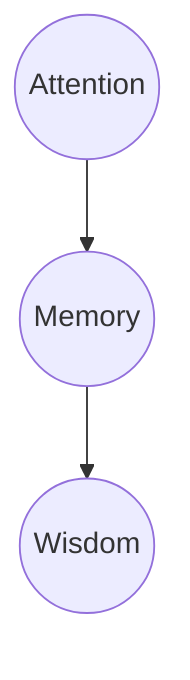
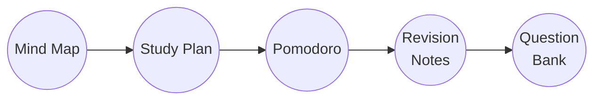

<iframe src="https://archive.org/embed/science-of-successful-learning" width="640" height="80" frameborder="0" webkitallowfullscreen="true" mozallowfullscreen="true" allowfullscreen></iframe>

No matter who you are, we all have 24 hours in a day—168 hours in a week. What will you accomplish in that time? At the end of each day, we are the product of our choices.

The number of hours that people have in the day hasn't changed, but the amount of time that people spend on online platforms has. "I cannot make my days longer, so I strive to make them better" (Henry David Thoreau). It is not death that one should fear, but never beginning to live. How many of the posts you recently scrolled through on social media do you remember? Not many? Were they even worthwhile? So, was there much difference between scrolling and being a corpse? 

All throughout history, there has never been a shortage of shills peddling things like snake oil or detox teas. With the ease of accessibility afforded by the Internet, this deceptive behavior is amplified and even incentivized. When it comes to learning something new, it seems like everyone online has a miracle shortcut or guide for learning anything. There’s no magic solutions for learning better and faster. The reality is that most of these are just short-term tricks or minor productivity boosts. In essence, learning demands strategic planning, self-awareness, and thoughtful, deliberate effort. This guide will show you what's essential for effective learning and improving memory as supported by scientific research. For the sake of easy reading, I'm not going into the nitty gritty of the academic papers.

Let's dive into the science of successful learning! As you'll soon learn, the answer is SAAD!

# Why Learn?

We learn because it is critical for preserving ourselves in our navigation of the world.

> Learning is a relatively permanent change in knowledge/behavior resulting from past experience.

Without learning, we wouldn't be able to properly adjust ourselves to what is required out of us. In short, without learning, ***we wouldn't live.***

Two parts of learning are **thinking** and **attention**:
- **Thinking** is a cognitive behavior in which ideas, images, mental representations, or other hypothetical elements of thought are experienced or manipulated. In this sense, thinking includes imagining, remembering, problem solving, daydreaming, free association, concept formation, and many other processes. Thinking encompasses a flow of ideas and associations that can lead to logical conclusions.
- **Attention** refers to the cognitive process of selectively focusing on specific information or stimuli while ignoring others. Attention is the mother of memory and memory is the mother of all wisdom.

# Why Study?

We study so that we can commit our learning to memory. In other words, we study to remember what we learn.

The more learning that we commit to memory, the greater our performance over time. In other words, we are better able to properly adjust ourselves to what is required out of us. In short, more studying commits more of our learning to memory, and ***we can live better.***

Memory is not about *collection*, it’s about ***connection***. Don’t let your prior beliefs pigeonhole your learning, otherwise, you will not learn new things.

## Beliefs that often obstruct learning new things

"Learning is fast."
"Knowledge is composed of isolated facts."
"Being good at a subject is a matter of inborn talent."
"I'm really good at multi-tasking."

⚠️ All in all, committing our learning to memory is great. Although, beware that forgetting is a threat to our memory.

# Who is Our Enemy for Learning?

Teachers and professors that quiz us are not our enemy. The correct question, instead, is not 'who is our enemy' but rather 'what is our enemy?' When we learn new things, we are committing those new things to memory, and we can lose that memory through forgetting.

> We want to combat our enemy: the forgetting curve.

## The Forgetting Curve

- Formulated by Ebbinghaus. The theoretical curve explains how acquired knowledge fades from memory over time.

Imagine you learn a new concept in math class today. If you don’t review it again soon, you’ll likely forget it and struggle to remember it later. This is similar to how learning works: to really understand and retain a new topic, you need to revisit it regularly—like reviewing your notes once in an hour, then the next day, and again next week. This regular practice helps reinforce what you've learned and prevents it from fading from your memory. Your brain needs this ongoing reinforcement to keep new information fresh and accessible.

In fact: the absolute best practice is to test yourself on the material that you were just exposed to very soon after your first exposure to it because that offsets the natural forgetting of new material that the brain is exposed to.
- Use this testing as a tool, not just for evaluating performance for knowing what you know and don't know, but for consolidating that information in your neural circuits.
	- I cannot stress this enough: test yourself or be tested soon after exposure to material as this would half the amount of forgetting even out to a year later. This will save yourself a lot of time and make the time spent studying both effective and optimal.

## The Seven Sins of Memory (Daniel Schacter)

In addition to forgetting, it is important to note that there are also other enemies to forgetting.

❗ Numbers 1-3 are sins of omission; 4-7 are sins of commission.

1. Transience: forgetting over time
2. Absent-mindedness: breakdown of the interface of memory and attention
3. Blocking: memory is available, but recall is difficult
4. Misattribution: recall some aspect of an event correctly, but get source wrong
5. Suggestibility: misinformation is incorporated into memory
6. Bias: our current knowledge, beliefs, and feelings impact/skew/distort memories
7. Persistence: intrusive memories, often traumatic

# Combatting Our Enemy, the Forgetting Curve, by Using Effective Ways to Learn and Remember (SAAD)

📢 The following four ways are effective study strategies for learning because they commit learning to memory by achieving deep processing which makes memory less liable to be forgotten.

1. Spaced repetition/retrieval
2. Active recall
3. Associations
4. Desirable difficulty

As a way to remember, you'll be SAAD if you forget 😭

# Spaced Repetition/Retrieval

🥇 The number one way to halt the forgetting curve is through spaced repetition/retrieval. You can do this through spacing out bouts of self-testing which practices retrieving new learning from memory with the appropriate retrieval and application.

> "The Testing Effect (the power of retrieval): A child stringing cranberries on a thread goes to hang them on the tree, only to find they’ve slipped off the other end. Without the knot, there’s no making a string. Without the knot there’s no necklace, there’s no beaded purse, no magnificent tapestry. Retrieval ties the knot for memory. Repeated retrieval snugs it up and adds a loop to make it fast" (Make it Stick).

Space out your retrieval practice until you can:
1. Practice without referring to notes
2. Practice using the information in a way the teacher expects

Spaced repetition disrupts the forgetting curve. The less the decay, the flatter the curve – that is, the longer the memory lasts.

Spacing out your retrieval practice is the **whole** premise of spaced repetition. The science of learning shows that the right interval between repetitions is the longest interval before which you would have otherwise forgotten the concept.

So, if you can figure out how to practice a skill or repeat knowledge you need to learn in the short, medium, and long term, then you’ll have a solid plan for learning it so much more efficiently.

It takes **practice and repetition** to ingrain new habits. Spaced repetition helps shift out that forgetting curve in just the same way it does with studying or learning.

The more frequently you practice a skill or review information, the longer you’ll retain it, effectively extending the "forgetting curve" until the information or skill becomes firmly entrenched in your memory.

[How to study effectively: The ultimate guide](https://www.brainscape.com/academy/how-to-study-effectively/)

You cannot achieve permanent memory by cramming. You have to *be consistent* in order to commit something to memory. Even better, spread or space your studying over a longer period of time.

[Optimize your brain health for effective studying](https://www.brainscape.com/academy/brain-health-studying/)

Trees growing in windy environments become more resilient by producing "stress wood," but only if they face continuous and progressive exposure to the wind over time. A single large storm won't permanently strengthen a sapling (if it even survives). Trees require repeated windy days to "learn" how to build tougher fibers.

The concept of spaced repetition also applies to your immune system. After receiving a full dose of a vaccine, you might get a booster shot six months later, and another one ten years down the line. Your immune system "remembers" the defense it created in response to the vaccine's stimulus. Doctors have identified the ideal timing for boosters, which is just before your body might begin to lose its ability to defend against the targeted pathogen.

Similarly, the principle of spaced repetition applies to muscular hypertrophy through progressive overload. When you lift weights, your muscles experience micro-tears. It’s not the one heavy workout that builds lasting strength; instead, it's the consistent repetition of challenging your muscles over time. By gradually increasing the load or intensity, your muscles "learn" to adapt and grow stronger. This process requires regular stimulation and recovery to allow the fibers to rebuild and fortify themselves, much like the tree responding to the wind or the immune system remembering a vaccine.

Consistency, with systematically expanding intervals of repetition, is the secret to all biological growth, human and otherwise. There are no shortcuts. No cramming. The world is beginning to realize this and so should you, if learning is important to you.

# Active Recall

🗃️ Do not engage with your learning and memory passively. Simple exposure does not sufficiently commit things to memory.

For example simply highlighting notes is a passive way of studying that does not yield long term commitment to memory. I do not suggest doing this as a form of studying.

Also, recognition (e.g. multiple choice) is also a similar yet separate form of studying which isn’t as effective as active recall.

"How readily you can recall knowledge from your internal archives is determined by context, by recent use, and by the number and vividness of cues that you have linked to the knowledge and can call on to help bring it forth" (Make it Stick).

Below are techniques that enhance active recall and improve memory retention by leveraging different aspects of cognitive psychology.

## Distinctiveness

Unusual information has the effect to generally be **recalled better than common information.**

## Mnemonic Devices

Mnemonics, named after the personification of memory in Greek mythology, Mnemosyne, are a form of encoding.

Any learning technique that aids information retention or retrieval (remembering) in the human memory for better understanding.
- SAAD is one such mnemonic device that aims to help you remember the four effective strategies for learning: Spaced repetition, Active recall, Associations, Desirable difficulty.

Chunking large bits of information into more digestible bits.
- [Expert Chess Memory: Revisiting the Chunking Hypothesis](https://doi.org/10.1080/741942359)

## Flashcards

You have to master the basics before moving on to more complex skills.

Use Anki. It is an open-source flashcard application that automatically uses spaced repetition algorithms to **help you prevent natural forgetting**. Anki can help you to intentionally commit information into long-term memory by automatically adjusting based upon your unique pace of learning. Personally, I think it is better than Quizlet.

[Anki - powerful, intelligent flashcards](https://apps.ankiweb.net/)

# Associations

✅  Make correct use of the information that you are learning and committing to memory.

## Reflection/Personal

A process of personalizing and understanding the contents, process, and the rationales for what we have learned. Through reflection, we relate our personal experience to a wider perspective, which helps us to see the bigger picture. Recognize and take advantage of prime learning opportunities so that you have a larger pool of reflective/personal experiences to draw from.

## Elaboration

A cognitive learning strategy that involves any enhancement of information that clarifies or specifies the relationship between information to-be-learned and related information, i.e., a learner's prior knowledge and experience or contiguously presented information. Find the value in what you are studying in order to do your best.

## Sanctity of Space and Termination Phrase

When there is no physical separation or boundaries between home and work or school, people can develop a “toxic productivity” mindset, in which every moment of the day NOT spent *achieving something* feels wasted. This can lead to unfounded guilt, stress, anxiety, burnout, and even depression. I personally experienced this phenomenon while going through Zoom University in my room during the pandemic. Consider the contextual associations for the places where you intend to work. For example, try not to work on your bed because you associate your bed with sleeping—not studying.

To close the loop, make sure you have a termination phrase (e.g. shutdown complete) to signal the end of your work or study session, helping to create a clear boundary between productivity and relaxation. This practice can help prevent the blurring of lines between work and personal time, reducing the risk of burnout and maintaining a healthier balance.

## Sherlock's Mind Palace (Method of Loci)

Using images to cue memories of what you learned.

## Generation of Questions or Concept Maps

This process transforms what you are learning by making it meaningful and engaging.

## Depth of Processing MATTERS!

# Desirable Difficulty

💪 Make studying an optimal challenge with just enough frustration. Your level of understanding is a direct result of how hard you prepare. Improvement involves dealing with challenges, difficulty, and uncertainty.

"Embrace the fact that significant learning is often, or even usually, somewhat difficult. You will experience setbacks. These are signs of effort, not of failure. Setbacks come with striving, and striving builds expertise. Effortful learning changes your brain, making new connections, building mental models, increasing your capability. The implication of this is powerful: Your intellectual abilities lie to a large degree within your own control. Knowing that this is so makes the difficulties worth tackling. Following are three keystone study strategies. Make a habit of them and structure your time so as to pursue them with regularity" (Make it Stick).

## Interleaving Topics (leveraging open loops)

"First, that some difficulties that require more effort and slow down apparent gains—like spacing, interleaving, and mixing up practice—will feel less productive at the time but will more than compensate for that by making the learning stronger, precise, and enduring. Second, that our judgments of what learning strategies work best for us are often mistaken, colored by illusions of mastery" (Make it Stick).
- We can accomplish this by interleaving the study of different problem types.

Servers in restaurants are unbelievably good at being able to recall exactly what a table's order was while that table's order is still open. As soon as the table was closed they couldn't remember anything. This is an example of an open loop vs. closed loop system and it's built into the brain.

The brain abhors an open loop. It's the same reason why Netflix has cliffhangers at the end of every episode which almost guarantees that you'll watch the next one because you can't bear the fact there's an incomplete resolution.

Considering how powerful open loops are, there are even novels in the dark romance genre that make guarantees that there won't be cliffhangers. They put it on the front or back of the book because people have so much distaste for open loops that it has become a selling point. We need to close the loop; we need to get the closure at the end of it.

In regards to writing, finishing halfway through a sentence reduces the activation energy required to begin that sentence the next day. The open loop keeps it in your mind overnight.

## Illusion of Mastery

Brute rote and repetitive memorization feeds the illusion of mastery. As a result we develop poor metacognition where we think we know what we know. The Dunning-Kruger Effect warns us not to confuse confidence for competence. It ain't what you don't know that gets you into trouble, it's what you think you know that ain't so. Sadly, many of our poor study strategies rest on faith and intuition. Overconfidence should be avoided at all costs.

"We harbor deep convictions that we learn better through single-minded focus and dogged repetition, and these beliefs are validated time and again by the visible improvement that comes during “practice-practice-practice.” But scientists call this heightened performance during the acquisition phase of a skill “**momentary strength**” and distinguish it from “**underlying habit strength**.” The very techniques that build habit strength, like spacing, interleaving, and variation, slow visible acquisition and fail to deliver the improvement during practice that helps to motivate and reinforce our efforts" (Make it Stick)
- Internalization of behaviors vs externalization of behaviors

### Automaticity

Where a process is so highly practiced that it occurs without any conscious effort.
- For example, blocking in classical conditioning.

### Overlearning

Continuing to study beyond just knowing information to where it can be recalled quickly and easily.

### Blurting (Writing FBR)

As a way to find out if we are falling victim to the illusion of mastery, we can try blurting. This is a stream-of-consciousness way for assessing what we truly know. This involves blurting out all you know by either writing or typing out all you know without the help of notes.

We can write Fast, Bad, and wRong. This is a way to just get everything out of your head and onto a page. Write fast and embrace mistakes—don’t worry about style or facts. This frees you to follow the story without stopping, like keeping momentum on a highway. When you let the narrative flow quickly, it can lead to unexpected places, but only if you keep moving swiftly. As an aside to this FBR, I do a similar meditative practice called freestyle rap; it's like therapeutic rhythmic spoken word poetry.

## Calibration

A measure of how accurately individuals assess their confidence in their own knowledge. Self-regulated learning is a process of developing goals, using strategies, and monitoring performance in order to complete tasks. Receiving feedback helps with calibration because feedback helps you understand where your learning is so that you can get better.

We should regularly self-quiz, space out practice, interleave the practice of different but related topics or skills, try to solve a problem before being taught the solution, distill the underlying principles or rules that differentiate types of problems, and so on.
- Feedback on incorrect answers strengthens retention more than testing alone does. And some evidence shows that delaying the feedback briefly produces better long-term learning than immediate feedback.
	- "This finding is counterintuitive but is consistent with researchers’ discoveries about how we learn motor tasks, like making layups or driving a golf ball toward a distant green. In motor learning, trial and error with delayed feedback is a more awkward but effective way of acquiring a skill than trial and correction through immediate feedback; immediate feedback is like the training wheels on a bicycle: the learner quickly comes to depend on the continued presence of the correction."

## Timetable

Successful learning requires planning ahead. Accomplish this by blocking out the time you need to get things done. You can easily organize your learning and studying by using Google calendar. When planning in advance the blocks of time, be realistic with how long things actually take to do.

Time blocking aims to stop Parkinson's Law which is a phenomenon where work expands so as to fill the time allocated for its completion. If there were no deadlines, nothing would ever get done. This law explains why we procrastinate last minute because we are literally up to the very end of the time we have available to complete that something.

## 80/20 rule (Pareto Principle)

In 1906, Italian economist, Vilfredo Pareto, noticed annually, 20% of pea pods in his garden produced about 80% of peas. The Pareto principle shows that for many events, roughly 80% of the effects come from 20% of the causes. The following graphic is an application of the Pareto principle to community fund raising. Since time is precious, apply this to work, studying, learning, and attention.

This means that extending beyond 20% of the causes will begin netting you **diminishing returns**. In other words, you will be doing more work for less total effects.

Know when to grit or quit. Know when to outsource or stop entirely so that you are not operating from a deficit of diminishing returns.

## Pomodoro technique

The Pomodoro techniques aims to minimize distraction since effective preparation requires your total focus.

One Pomodoro is 25 minutes of strictly studying without distraction followed by 5 minutes of rest doing whatever you want. After every four Pomodoros, increase your rest time by another five minutes.
- 25 min on; 5 min off (4x)
- 25 min on; 10 min off (4x)
- And so on, but *ideally* you really shouldn't be studying for that long because of diminishing returns (Pareto Principle).

### THE VALUE OF 5–10-MINUTE BREAKS

This is exactly why the pomodoro method works: The serial position effect refers to improved recall observed at the beginnings and ends of lists. Separately, these are called the primacy effect and recency effect, respectively. Memorizing a hypothetical list of 20 words, your recall might look something like this:
 
 This mid-list dip can be observed in study sessions as well, so a 90-minute session might resemble the below graph:

We can dramatically improve recall by splitting that single session into two sessions of 45 minutes with a 10-minute break in between.
  

### The Von Restorff Effect

The Von Restorff effect, also called the novel popout effect, correlates unique items in a list to better recall. For example, if the fifth item in a word list uses a unique color or a larger font size, it will be better remembered than others. This is perhaps obvious. What isn’t obvious is that planting odd material in the middle of a session can produce a macro–Von Restorff effect.

Let’s assume we have a list of 100 plain-Jane, high-frequency words, split into 50 words per 45-minute session. The recall will look just as it did in the primacy and recency effect graph.

Now we spike the punch in the middle of each 45-minute session, injecting 2–4 idiomatic phrases that are sexually related from minutes 20–25. There are two content changes: the sexual content and, almost as important, the word-to-phrase shift. In my experience, the memory curves can then morph into the above graph.

Instead of averaging out at 60%–70% recall over a week, say, we can get well over 80%. Furthermore, it’s a more sustainable and pleasant learning approach. This is the approach I used with the Linkword method to achieve more than 85% retention of 350 Italian words 72 hours after cramming them into 12 hours.

# Let's Summarize! Pause and Reflect.

Before we move onto the next area which goes into actual notetaking, I want to summarize SAAD so we don't forget.

## Spaced Repetition/Retrieval

Spaced repetition is the most effective way to combat the forgetting curve, helping to retain information by spacing out self-testing and retrieval practices over time. The more frequently you engage with a skill or review information, the more deeply it becomes embedded in memory, gradually extending your retention. Just like in biological growth or muscle strengthening, consistent practice over expanding intervals is essential for lasting memory and learning—there are no shortcuts or substitutes for repetition and persistence.

## Active Recall

Unusual information is generally recalled better than common information, making ***distinctiveness*** a key factor in memory retention. ***Mnemonic devices***, like SAAD, help organize and encode information to aid in more effective learning and retrieval. ***Flashcards*,** particularly through tools like Anki, utilize spaced repetition to enhance long-term memory retention by adapting to your personal learning pace.

## Associations

Creating meaningful associations between new information and what you already know helps commit it to memory and improves recall. Through ***reflection***, you can personalize what you've learned by connecting it to your own experiences, making the content more relatable and easier to grasp. ***Elaboration*** further enhances learning by clarifying the relationships between new and existing knowledge, ensuring that you not only remember information but understand its relevance. Protecting the ***sanctity of space*** is important, as studying in dedicated areas rather than places associated with relaxation, like your bed, helps improve focus and reduce burnout. To further reinforce this boundary, use a ***termination phrase*** (e.g., "shutdown complete") to clearly mark the end of your study or work session, preventing the overlap between productivity and relaxation. Techniques like ***Sherlock’s Mind Palace*** use imagery to create strong memory cues, making information more memorable through visual association. Lastly, generating ***questions or concept maps*** transforms passive learning into active engagement, allowing for deeper processing and better retention.
## Desirable Difficulty

Embracing desirable difficulty means pushing yourself to study at an optimal level of challenge, which fosters deeper learning and builds lasting expertise. Strategies like ***interleaving topics*** take advantage of open loops to enhance retention, even though they may feel less productive initially. To avoid the ***illusion of mastery***, it's essential to be aware that you're not becoming ***automatic*** and ***overlearning***. Incorporate ***self-quizzing*** and ***blurting*** to ensure true understanding rather than just surface-level familiarity. The ***Pomodoro technique*** helps maintain focus and minimize distractions by breaking study sessions into 25-minute intervals, followed by short breaks, which aids in combating mental fatigue. Taking timed breaks can also help leverage the ***serial position effect*** and ***Von Restorff effect***, improving recall by breaking sessions into more manageable chunks.

# On Notetaking: How Can We Effectively Take Notes?

Content extracted from: [note-taking guide](https://thesishub.org/note-taking/)

## Why take notes?

⏰ Notetaking engages you in the class and keeps you awake. As you check your notes, are your notes reflecting deep processing or superficial processing?

Note-taking is part of the learning process and a skill all students need to master to have a useful and accurate account of lectures and readings. The key is to capture knowledge accurately in a way that is meaningful and pleasing to you.

Personally, I use Obsidian for all of my notetaking. In fact, I am using it to type up these very words that you are reading now. Obsidian is a powerful note-taking app designed for creating and managing a personal knowledge base. It uses a system of interconnected markdown files, allowing users to build a network of notes and link related concepts effortlessly. Its flexibility and rich feature set, including graph views and plugins, make it ideal for organizing complex information and enhancing productivity.

### Note-taking is able to:

- Enhance listening and concentration skills
- Provide a personal record of the lecture/reading
- Help you understand and remember lecture/reading content
- Provide material for assignments and revision
- Identify relevant material
- Connect prior knowledge with new.

### Effective notes are:

- Accurate
- Brief
- Preferably in your own words
- Accurately referenced
- Relevant
- Organized
- Easy to read
- Understandable
- Able to provide a key summary

### Taking notes in lectures before class

- Review previous lecture notes and check the topic for the next lecture. Do any recommended readings. Review what you may already know on the topic.
- If there are slides/outlines already provided beforehand, add your notes to them before or during lecture. Focus more on attentively listening to professor and make note of clarifying additions that are not on the slides/outlines.

### Taking notes in lectures during class

- Sit where you are comfortable and where you are least distracted.
- Depending on the professor, consider permission for recording the lecture.
    - For various reasons recording a lecture is not recommended and should only be used under special circumstances and with the knowledge of all those present:
    - Involves passive rather than active learning.
    - No record of board work, non verbal cues, etc.
    - Privacy laws may be breached.
- Head notes with the date, topic and tutor’s name. Number all pages, keep the topic in mind, and identify the introduction, main points and conclusion.
- Develop good listening skills and listen actively for all verbal cues (e.g., “There are two main reasons . . . “) and non-verbal cues (e.g., facial expressions).
- Do not write down everything you hear.
- Develop a system that is pleasing to you and make use of colour, diagrams etc.
- Develop a system of abbreviations and legible handwriting.
- Leave space whenever you miss a point and go back later. Lots of white space is useful for either adding information during the lecture or when revising and doing further research.
- Get missed information right away; do not hesitate to ask questions.
- Link your notes to any handouts and suggested readings.

### Taking notes in lectures after class

- Actively organize and review lecture notes by filling in gaps and summarizing in your own words. Revising your notes will check your understanding and also give you a better chance of putting the information into your long-term memory. Have a good filing system.
- Highlighting and colorful notetaking does not help you to learn because it is often a passive way of learning.
- Do not borrow other students' notes.

### Lecture notes should include

- Relevant material on the whiteboard.
- All examples, formulas, definitions, quotations, references.
- White space for later additions and to fill in gaps.
- Any relevant student questions – and the answers.

## Note-taking layout methods

There are various ways of laying out notes. Use a method that suits you; this may mean incorporating a number of different styles. Make use of diagrams, colour, headings, sub-headings, numbers, and columns. Make notes in a way that is pleasing for you to use and understand. Leave plenty of white space so that your notes not only look more inviting, but also give you space to add anything you missed.

### Linear (lines of words)

The following explanation of the linear method is set out in the linear style.

1. This is a traditional format most of us are familiar with and is therefore easy to do and read. The words flow on the page from left to right, top to bottom.
2. This method makes use of:
    - Headings for main ideas
    - Subheadings for detail
    - Indentation
    - Bullet points and numbering
    - Key words
    - Abbreviations
3. Do not write down everything you hear, rather:
    - Summarize the tutor’s main points
    - Watch for visual and verbal signposts
    - Leave space for missed information
4. You may use a combination of bullet points and full sentences.

### Writing sentences

When using this method, there is a need to write quickly and legibly. It is helpful to use abbreviations (e.g., imp., esp.). It is a time-consuming method, but the upside is that a lot of detail can be included.

### Mind maps (spidergrams), diagrams, pictures

This system gives you the freedom to connect ideas and knowledge in a creative way. It is especially useful for brainstorming, planning, revision, and summaries.

- Limit the number of words on a line.
- Be organised and do not clutter the map with excess information.
- Make use of colour, different fonts, and a variety of shapes.
- The main idea is usually in the centre, with key words interconnected by lines, arrows, and symbols.
- Templates may be hand drawn or examples downloaded off the internet.
- Use your imagination to create unique and personal mind maps that help you to remember information.
    - Create a set of memory cues: e.g. Sherlock's mind palace/method of loci
- Linear/sequential notetaking pitfalls:
    - Conceptual learning is better for insight because insight is almost always the rearrangement of fact.
    - All you got to do is a make a unique connection.

### Princeton (charting) method

This method is not so common for general note-taking purposes. It is a useful way of storing information in chronological order. Usually 3 columns are drawn across the page (you may need more), each with its own heading.

This method is also useful for making notes from readings. The first column is used for the heading and main points and the second for the summary. The third column is useful for when you review your notes and add extra details, examples and ideas that may occur to you later.

| Headings, main points, etc. | Summary of the notes | Blank column for use later when reviewing, examples, etc. |
| --------------------------- | -------------------- | --------------------------------------------------------- |
|                             |                      |                                                           |

### Cornell Method

This popular and well-structured method requires the page to be divided into two columns. The left-hand column is usually used after class for summaries, reflection, and any extra information; 5 – 10cm seems to be an optimum width. The main right-hand column is used to record the lecture.

| 5-10cm; add extra information missed during class, review your notes, make summaries, and add your ideas, reflections, and questions | Record lecture here in as much detail as you wish and in your own style |
| ------------------------------------------------------------------------------------------------------------------------------------ | ----------------------------------------------------------------------- |
|                                                                                                                                      |                                                                         |

## Making notes from readings

1. The same points apply to research notes as apply to taking notes in the classroom. However, when making notes from readings, it is imperative that, before you begin to make notes, you keep an accurate record of your references.
2. Your notes need to be:
    - **Accurate:** Do not change the author’s meaning
    - **Brief:** Copy down the main points only. Develop a system of abbreviations and symbols
    - **Relevant: B**e selective in your reading, seeking information relevant to the topic and avoiding lengthy examples and repetitions
    - **In your own words:** Paraphrase as much as possible. You will often use key words from the text, but do not copy down chunks of writing from the source. If you do copy down the exact words, use quotation marks to indicate a direct quotation
3. Remember to:
    - Record relevant references (use a citation manager like Zotero).
    - Date your notes.
    - Keep notes made from different sources in a separate folder.
    - File your notes carefully where they are readily accessible.
        - Separate the forest from the trees. In other words, devise a sort of filing system for understanding the layers of what you are learning.

## References

- UNSW. (2013). Effective reading and note-taking. Retrieved from [link](https://student.unsw.adu.au/effective-reading-and-note-taking)
- University of Reading. (2015). Study advice: Effective note taking. Retrieved from [link](http://www.reading.ac.uk/internal/studyadvice/StudyResources/Reading/sta-effective.aspx)
- The Open University. (2013). Skills for OU study: Example of linear notes. Retrieved from [link](http://www2.open.ac.uk/students/skillsforstudy/image-linear-notes.php)
- Mindtools. (2015). Mind maps: A powerful approach to note-taking. Retrieved from [link](https://www.mindtools.com/pages/article/newISS_01.htm)
- Massey University. (2012). Note-taking. Retrieved from [link](http://owll.massey.ac.nz/study-skills/note-taking.php)
- La Trobe University. (2015). Taking notes. Retrieved from [link](http://www.latrobe.edu.au/students/learning/develop-skills/taking-notes)
- James, J., & Brooks, J. (1996). Study skills guide. Porirua, New Zealand: Whitireia Community Polytechnic.
- Infinite Minds. (n.d.). How to use mind maps. Retrieved from [link](http://infiniteminds.info/Problem-Solving-and-Creativity/How-to-use-Mind-Maps.html)
- Freeman, R., & Meed, J. (1993). How to study effectively. Cambridge, England: Collins Educational.
- Dartmouth College, Academic Skills Center. (2001). Taking lecture and class notes. Retrieved from [link](http://www.dartmouth.edu/~acskills/success/notes.html.)

# Mistakes in productivity

- Thinking you have to be 'on' the whole time
- Not scheduling fun stuff
- Screen time blocks not actually being used
- Define your priorities first so that you don't feel guilty later
- Get over and beyond the fear of failure or falling short of perfection
- Take a step back and look at your place in the greater system. You cannot be graded on everything i.e. personality, character, etc.

# Going Forward

🔄 Make SAAD a habit or else you will forget! By making it a habit, you don't even have to remember to perform the process!

1. Burnt out? -> Use Obsidian as a second brain
2. Unmotivated? -> Use pomodoro technique (Forest app)
3. Revising? -> Blurting method/writing FBR
4. Procrastinating? -> 5 minute rule: tell yourself that you only have to do it for 5 minutes, then as you start you'll realize that the inertia from starting will keep you engrossed more than 5 minutes
5. Memorizing? -> Spaced repetition with Anki
6. Multiple subjects? -> Interleaving

## Study Workflow

The best time to decide things was yesterday. The second-best time to decide things is now! Don’t expect returns on investments you haven’t made. Don’t waste time now by deferring until later. Change your life today. Don’t gamble on the future, act now, without delay. Don’t get *through* the day. Get *from* the day. We did not come into this world; we came out of it. You may not reap the results you immediately want, but you can begin the process now. In the process, you free yourself one chain at a time. How can you presently live so that the results can naturally come?

> Life is short. Do things now!

Here's a demonstration explaining why our perception of time flies:

[Why Time Flies](https://www.maximiliankiener.com/digitalprojects/time/)

Here's a fun game recapping what we went over:

[How To Remember Anything Forever-ish](https://ncase.me/remember/)

# Future Directions?

🤔 Since we now understand the power of remembering, is it possible that we could ever harness the power of forgetting? Would it ever be possible to forget what you wanted?

One of the shortcomings of our temperamental memory is that we forget what we want to remember, and we remember what we want to forget.

Cicero describes the story of Themistocles where Themistocles remarks about the Sage's power of mnemonics:

> "...and Themistocles replied that he [the Sage] would be doing him a greater kindness if he taught him to forget what he wanted than if he taught him to remember" (de Oratore Book II, LXXIV / 2.74.299-300).

# Recommended Resources/References:

- [How to Get the Most Out of Studying](https://www.samford.edu/departments/academic-success-center/how-to-study)
- Make it Stick: The Science of Successful Learning by Peter C. Brown, Henry L. Roediger III, and Mark A. McDaniel.
- The Only Study Guide You'll Ever Need by Jade Bowler